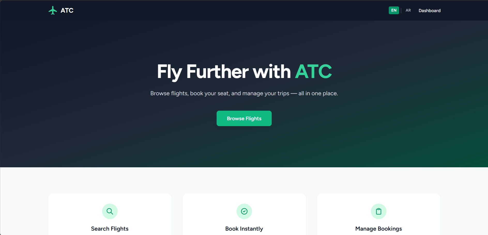
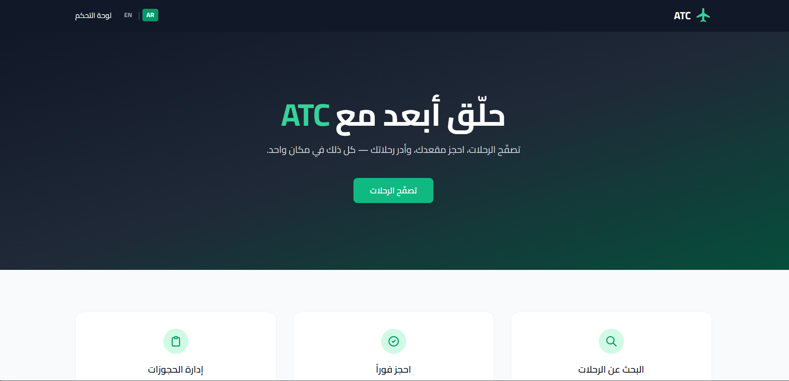
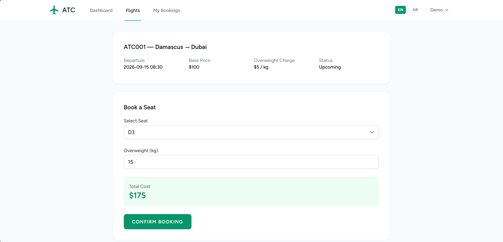
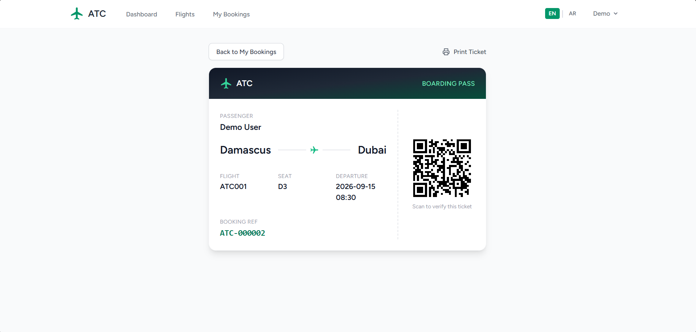
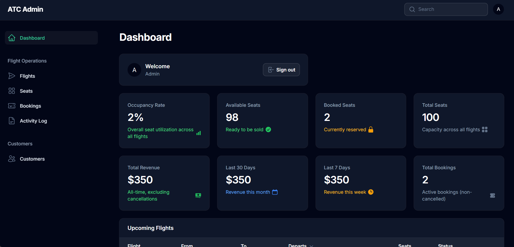
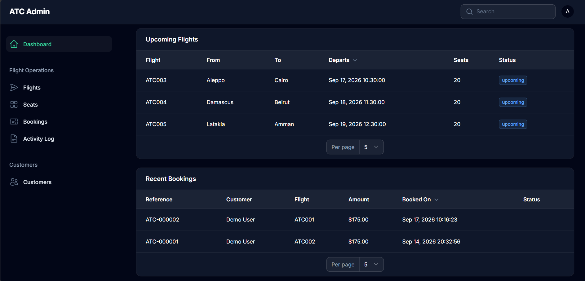

<p align="center">
  
</p>

<h1 align="center">ATC — Airline Travel Company</h1>

<p align="center">
  A full-stack airline booking platform, rebuilt from a legacy PHP codebase into a modern, real-time, bilingual Laravel application.
</p>

<p align="center">
  
  
  
  
  
  
  
</p>

<p align="center">
  <a href="#demo">Demo</a> ·
  <a href="#the-story">The Story</a> ·
  <a href="#technical-highlights">Technical Highlights</a> ·
  <a href="#features">Features</a> ·
  <a href="#getting-started">Getting Started</a> ·
  <a href="#architecture-decisions">Architecture Decisions</a>
</p>

---

## Demo

| | |
|---|---|
| **Live demo** | _coming soon_ |
| **Customer login** | `demo@atc.com` / `password` |
| **Admin panel** | `/admin` — credentials on request |

<table>
  <tr>
    <td width="50%"></td>
    <td width="50%"></td>
  </tr>
  <tr>
    <td align="center"><sub>Landing page</sub></td>
    <td align="center"><sub>Full RTL support with Arabic localization</sub></td>
  </tr>
  <tr>
    <td width="50%"></td>
    <td width="50%"></td>
  </tr>
  <tr>
    <td align="center"><sub>Live seat selection with real-time availability</sub></td>
    <td align="center"><sub>Digital boarding pass with QR verification</sub></td>
  </tr>
  <tr>
    <td width="50%"></td>
    <td width="50%"></td>
  </tr>
  <tr>
    <td align="center"><sub>Admin dashboard — occupancy, revenue, and activity at a glance</sub></td>
    <td align="center"><sub>Upcoming flights and recent bookings</sub></td>
  </tr>
</table>

---

## The Story

This project started as a university assignment: a bare-bones PHP/MySQL airline booking system with no framework, no authentication safeguards, and no real architecture. Rather than submit it as-is, I rebuilt it from the ground up as **ATC v2** — treating it as a real production-style application: proper authentication boundaries, a real admin panel, real-time features, and full internationalization.

It was also built the way a real engineering team works: two developers, a shared GitHub Projects board, feature branches, mandatory PR review, and protected `main`. Several of the bugs described below were caught during that review process — not hypothetical, actually shipped and actually fixed.

---

## Technical Highlights

A few decisions and problems worth pointing out, because they're where most of the actual engineering happened:

- **Two separate authentication systems, on purpose.** Staff (`users` table, Filament, `web` guard) and customers (`customers` table, Breeze/Livewire, `customer` guard) never touch each other. This surfaced a real bug during review: a password-confirmation screen was silently validating against the wrong guard (`web` instead of `customer`), which would have locked customers out of sensitive actions in production. Fixed and covered going forward.

- **Flight status is computed, not stored.** Early on, `status` (`upcoming`/`departed`/`arrived`) was a static DB column that never changed on its own — so a flight that had clearly already landed would still show as "upcoming" a week later. Replaced with a `getComputedStatusAttribute()` accessor that derives the real status from `departure_time` + `trip_duration_minutes` against the current time, everywhere it's displayed.

- **Real-time seat availability, debugged end-to-end.** Admin seat changes broadcast live to customers browsing the same flight via Laravel Reverb. Getting this working end-to-end meant tracing the full chain — queued broadcast events silently stuck because no queue worker was running, and a Livewire Echo listener that looked correct but was missing the leading dot required for custom event names (`.seat.updated` vs `seat.updated`). Both are the kind of bug that "looks fine" until you actually watch the WebSocket traffic.

- **RTL isn't a CSS toggle.** Full Arabic support meant a dynamic `dir` attribute per locale, a proper Arabic typeface (system fonts render Arabic noticeably worse than Latin scripts, so Cairo is loaded specifically for RTL contexts), and catching Tailwind's `space-x-*` utilities that don't mirror automatically under `rtl:` (fixed with `rtl:space-x-reverse`).

- **Booking cancellation without deleting financial records.** Booking foreign keys use `onDelete('restrict')` deliberately — customers can cancel a booking, but a cancellation sets `cancelled_at` and releases the seat rather than deleting the row, keeping the financial trail intact.

---

## Features

### Customer Portal

**Flights & Booking**
- Search and filter available flights by departure city, destination city, and date
- Live seat availability that updates in real time via WebSockets when an admin books/releases a seat elsewhere
- Seat selection with automatic overweight-charge and total-cost calculation before confirming
- Booking confirmation with a direct link to the digital boarding pass
- Self-service booking cancellation (with confirmation modal) that releases the seat and marks the booking cancelled without deleting the record
- Digital boarding pass view with QR code, styled as an actual ticket (perforated divider, passenger/flight/seat details)
- Public ticket-verification page (`/ticket/{reference}`) — the QR scan destination, requires no login, shows a clear valid/cancelled/not-found state

**Account & Profile**
- Registration, login, password reset, and password confirmation flows, all under the dedicated `customer` guard
- Profile editing (name, email, phone, date of birth), with passport number locked as read-only
- Password update and self-service account deletion, each with its own confirmation step
- Loyalty points, automatically accrued per booking

**Internationalization**
- Full English/Arabic localization across every customer-facing page — navigation, dashboard, flights, bookings, profile, and all auth screens
- Dynamic `dir="rtl"`/`dir="ltr"` switching with a dedicated Arabic typeface (Cairo) for proper legibility, not just a mirrored layout
- Language preference persisted in session and available from every page, including the landing page and auth screens

**Polish**
- Custom-designed favicon/branding and a custom 404 page (not the framework default)
- Empty states with icons and calls-to-action for "no flights found" and "no bookings yet", instead of a bare text line
- Toast/inline confirmation flows for destructive actions (cancel booking, delete account)

### Admin Panel (Filament)

**Dashboard**
- Seat occupancy overview (occupancy rate, available/booked/total seats), ordered by what matters first — the summary metric, not the raw counts
- Revenue overview (all-time, last 30 days, last 7 days, active booking count)
- Upcoming flights table, driven by real-time computed flight status rather than a stale DB column
- Recent bookings table with customer, flight, amount, and cancellation status at a glance

**Operations**
- Full CRUD for flights, seats, customers, and bookings, with field-level validation (unique flight numbers, seat numbers unique per flight, destination ≠ departure city, no seat double-booking)
- Auto-calculated booking total cost (base fare + overweight charge) that recalculates live as fields change in the form
- Per-customer booking history via a relation manager — no need to leave the customer's page to see what they've booked
- CSV/XLSX export on flights, seats, and bookings tables
- Spatie activity log tracking changes to flights, seats, and bookings (who changed what, and when)

**Access & UX**
- Role-gated destructive actions — only admins (not employees) can delete customers or bulk-delete records
- Global search across flights, seats, customers, and bookings from anywhere in the panel
- Dark mode
- Organized navigation grouped by domain (Flight Operations / Customers) instead of a flat resource list
---

## Tech Stack

| Layer | Technology |
|---|---|
| Framework | Laravel 12 (PHP 8.2) |
| Admin panel | Filament 3 |
| Customer frontend | Laravel Breeze + Livewire / Volt |
| Styling | Tailwind CSS |
| Real-time | Laravel Reverb (WebSockets) |
| Authorization | Spatie Laravel Permission |
| Auditing | Spatie Activity Log |
| Testing | Pest |
| Database | MySQL |

---

## Architecture Decisions

<details>
<summary><strong>Why two auth guards instead of one users table with roles?</strong></summary>

Customers and staff have fundamentally different lifecycles, data shapes, and security surfaces — a customer should never be able to reach `/admin` no matter what role field is manipulated, and that's structurally impossible (not just policy-enforced) when they're on separate guards and separate tables.
</details>

<details>
<summary><strong>Why compute flight status on read instead of a scheduled job?</strong></summary>

A scheduled command to flip status every N minutes would need to run continuously in every environment this app is ever deployed to, and would still be stale between runs. An accessor is always correct, requires no infrastructure, and costs nothing extra since flights are already being fetched.
</details>

<details>
<summary><strong>Why Reverb instead of Pusher?</strong></summary>

Self-hosted, no third-party dependency or cost for a portfolio project, and it's the officially supported first-party solution for Laravel broadcasting — worth learning over an external SaaS.
</details>

---

## Getting Started

### Prerequisites
- PHP 8.2+
- Composer
- Node.js & npm
- MySQL

### Installation

```bash
git clone https://github.com/Zain-Wahbi/ATC-V2.git
cd ATC-V2
composer install
npm install
cp .env.example .env
php artisan key:generate
```

Configure your database in `.env`, then:

```bash
php artisan migrate --seed
php artisan make:filament-user
```

### Real-time setup (required for live seat updates)

Broadcasting credentials are intentionally **not** committed. Add to `.env`:

```env
BROADCAST_CONNECTION=reverb

REVERB_APP_ID=atc-local
REVERB_APP_KEY=atc-local-key
REVERB_APP_SECRET=atc-local-secret
REVERB_HOST="localhost"
REVERB_PORT=8081
REVERB_SCHEME=http

VITE_REVERB_APP_KEY="${REVERB_APP_KEY}"
VITE_REVERB_HOST="${REVERB_HOST}"
VITE_REVERB_PORT="${REVERB_PORT}"
VITE_REVERB_SCHEME="${REVERB_SCHEME}"
```

### Running locally

Four processes, four terminals:

```bash
php artisan serve
npm run dev
php artisan reverb:start --port=8081
php artisan queue:work
```

- Customer portal → `http://127.0.0.1:8000`
- Admin panel → `http://127.0.0.1:8000/admin`

### Running tests

```bash
php artisan test
```

---

## Project Structure Notes

- `app/Models/Flight.php` — see `getComputedStatusAttribute()` for the dynamic status logic
- `app/Events/SeatStatusUpdated.php` + `routes/channels.php` — the real-time broadcast chain
- `lang/{en,ar}/app.php` — all customer-facing translation strings live here, keyed as `app.*`
- Dual guards configured in `config/auth.php`: `web` (staff) and `customer` (public portal)

---

## Author

**Zain Wahbi** — Backend & ML Engineer
[GitHub](https://github.com/Zain-Wahbi) · [LinkedIn](https://linkedin.com/in/zain-wahbi) · [Portfolio](https://zain-wahbi.github.io/zain-wahbi-portfolio)

**Dawood Zahlouk**
[GitHub](https://github.com/dawoodzahlouk4-DZ)

## License

All rights reserved. See [LICENSE](LICENSE) for details.